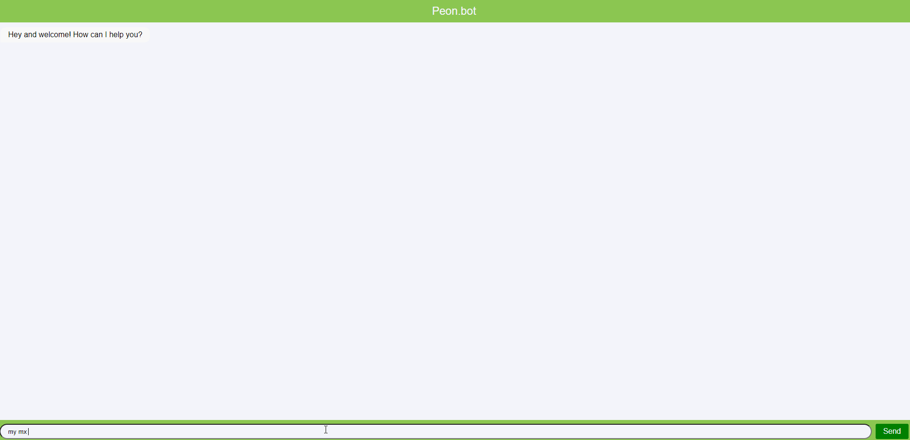
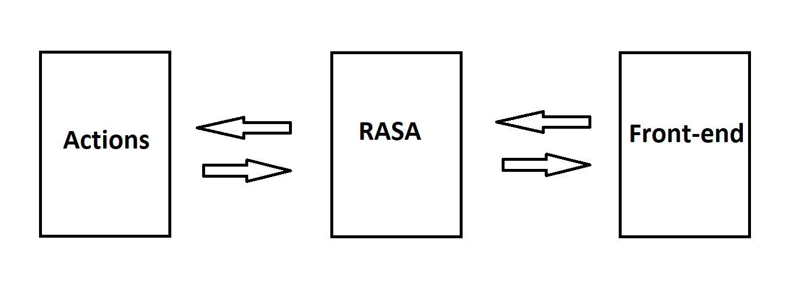

# **Peon.bot** 
**Chatbot made with <a href="https://github.com/rasaHQ/rasa">Rasa</a> that collects logs, troubleshoots problems, and provides a list of the requested commands.**

## Features

### Collecting [mx utilization logs](https://documentation.meraki.com/MX/Monitoring_and_Reporting/Device_Utilization):

### Collecting [mr logs](https://documentation.meraki.com/Meraki_Internal/Support/Mules/INTERNAL%3A_Troubleshoot_Wireless_Clients_Activity):

### Tshooting mx/mr/ms being unreachable in the dashboard:

### (in progress) Listing the commands:

## Installation:
1) To get started, you'll need to make sure that Microsoft Visual C++ is installed for Windows or Xcode for MacOS. 
The full guide for Microsoft Visual C++ can be found [here](https://learn.microsoft.com/en-US/cpp/windows/latest-supported-vc-redist?view=msvc-160). 
Xcode can be downloaded [here](https://apps.apple.com/us/app/xcode/id497799835?mt=12)
2) Next, you'll want to have anaconda. You can download this from [here](https://www.anaconda.com/download#downloads);
3) Once these tools are installed you can install Rasa Open Source with the following commands: 
conda create --name TEST python==3.8 
conda activate TEST 
python -m pip uninstall pip 
python -m ensurepip 
python -m pip install -U pip 
pip install rasa==3.5.10 

You should now be able to confirm that Rasa is installed with the following command: 
rasa -h 

4) Once the above is done, open settings.txt in Peon.bot folder and add your username (firstname.lastname) into the "user=" field.
5) Ensure that your id_rsa key is in ~/.ssh/id_rsa folder. On Windows systems the full path of the file is usually C:\Users\\<firstname.lastname>\\.ssh\id_rsa"

## How to launch:
The chatbot consists of back-end (RASA + action server) and front-end (simple js run on python web server):

You will need to run three servers on the computer in order to launch the bot.

RASA server:
1) open cmd.exe/terminal;
2) cd <path_to_the_peon.bot_folder>;
3) run the command 'conda actiavate TEST'
4) run the command 'rasa run --cors "*"'

Actions server:
1) open cmd.exe/terminal;
2) cd <path_to_the_peon.bot_folder>;
3) run the command 'conda actiavate TEST'
4) run the command 'rasa run actions'

Front-end server:
1) open cmd.exe/terminal;
2) cd <path_to_the_peon.bot_folder>;
3) run the command 'python -m http.server 8080'

Once the above is done, launch your web-browser and open localhost:8080 and have at it!
